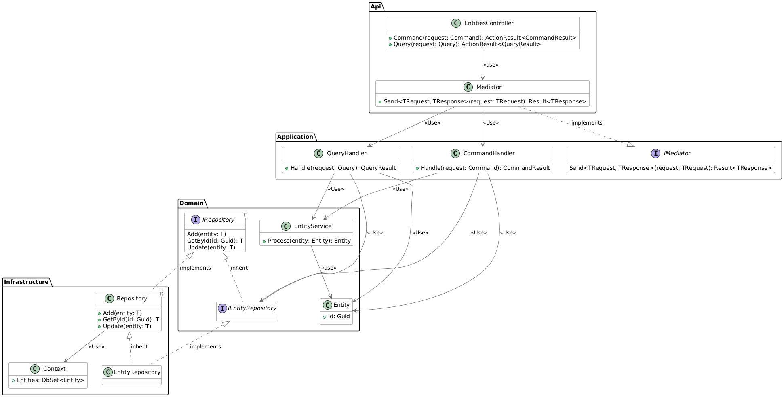

# Backend (Tuya) — README

Esta documentación está orientada a quienes deseen comprender, ejecutar o contribuir al proyecto Backend (Tuya).
Proporciona una visión general del proyecto, instrucciones de configuración y ejecución, y pautas para el desarrollo.

## Visualización general del proyecto

Esta solución es una API web .NET 6 que implementa una arquitectura en capas (inspirada en clean/onion).
Expone endpoints HTTP utilizando ASP.NET Core y los documenta con Swagger (openapi).

Proyectos:
- `src/Backend.Api` — ASP.NET Core Web API (punto de entrada).
- `src/Backend.Application` — Application: casos de uso, uso de CQRS, servicios.
- `src/Backend.Domain` — Domain: entidades, reglas de negocio, servicios, value-objects.
- `src/Backend.Infrastructure` — Infrastructure: persistencia (EF Core), integraciones externas, implementaciones.

## Resumen de la arquitectura


Ver diagrama completo aquí: [Diagrama de código](./docs/diagram.png)

- Separación en capas:
    - `API` depende de `Application` e `Infrastructure`, se encarga de levantar la aplicación y gestionar las dependencias.
    - `Application` contiene la orquestación de los casos de uso (servicios, comandos, consultas).
    - `Domain` contiene los tipos y reglas del dominio central.
    - `Infrastructure` contiene la configuración de EF Core y cualquier integración externa (base de datos, sistema de archivos, etc.).
- Se utiliza un mediador propio para implementar el patrón Mediator/CQRS en la capa de Application.
- EF Core (SQLite) es usado en `Backend.Infrastructure` para la persistencia de datos (paquete: `Microsoft.EntityFrameworkCore.Sqlite`).
- La API es documentada con `Swashbuckle.AspNetCore` (openapi) y está habilitada en el entorno de Desarrollo.

## Prequisitos

- .NET 6 SDK instalado (coincidente con el framework objetivo `net6.0`).
- Visual Studio 2026 (recomendado) o Visual Studio Code.
- Opcional: herramientas de SQLite como DBeaver si desea inspeccionar el archivo de la base de datos.

## Construcción y ejecución

Desde la raíz del repositorio:

1. Instalar dependencias y construir el proyecto:
```
dotnet restore
dotnet build
```

2. Ejecutar la API:
- CLI:
  ```bash
  dotnet run --project src/Backend.Api
  ```
- Visual Studio 2026:
  - Abre la solución `Backend.slnx` y asigna `Backend.Api` como proyecto de inicio.
  - Presiona F5 (Debug) o Ctrl+F5 (Ejecutar sin debug).

3. Comportamiento por defecto:
- Está habilitada la redirección HTTPS.
- Cuando ejecutes el proyecto en un ambiente `Development`, Swagger está disponible en:
  `https://localhost:{port}/openapi` (ver puerto en la consola).

## Configuración

- App configuration is read from `appsettings.json`, environment-specific `appsettings.{Environment}.json`, and environment variables.
- La configuración de la aplicación se lee desde `appsettings.json`, `appsettings.{Environment}.json` específico del entorno y variables de entorno.
- Las cadenas de conexión y las configuraciones del proveedor normalmente se configuran dentro de la extensión `AddPersistence` (consulte `src/Backend.Api` y `src/Backend.Infrastructure` para obtener detalles específicos).

## Base de datos / Migraciones

- Los paquetes de EF Core se referencian en `Backend.Infrastructure`.
- Si se utilizan migraciones, ejecútelas desde el proyecto de infraestructura o actualice la base de datos con la herramienta `dotnet ef` dirigida a `Backend.Infrastructure` (asegúrese de que las herramientas de diseño estén instaladas).

Ejemplo:
```
dotnet ef migrations add InitialCreate --project src/Backend.Infrastructure --startup-project src/Backend.Api
dotnet ef database update --project src/Backend.Infrastructure --startup-project src/Backend.Api
```

## Observabilidad y documentación

- Swagger (openapi) está habilitado en Desarrollo.
- El registro utiliza la canalización de registro predeterminada de ASP.NET Core; ajuste en `appsettings.*.json`.

## Notas de desarrollo

- La lógica de negocio se ubica en `Backend.Application` y `Backend.Domain`. Mantenga los controladores ágiles; orqueste mediante servicios o mediadores.
- Use la inyección de dependencias y evite las llamadas estáticas directas que dificultan las pruebas.
- Coloque las asignaciones y el contexto de EF Core en `Backend.Infrastructure` y exponga los repositorios o interfaces a la capa `Application`.
- Siga las convenciones de capas y nomenclatura establecidas.
- Agregue pruebas unitarias para la lógica del dominio y la aplicación; pruebas de integración para la persistencia y los endpoints de la API.